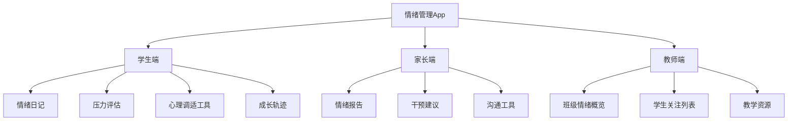

# 中小学生情绪管理软件 - 项目规划

## 1. 项目概述

### 1.1 问题背景
- 中小学生情绪问题日益凸显
- 情绪失衡影响学习和生活质量
- 需要专业的情绪管理工具支持

### 1.2 解决方案
开发一款基于Material Design的中小学生情绪管理App，提供情绪记录、压力分析、心理调适等功能。

## 2. 功能架构设计

## 3. 核心功能模块

### 3.1 情绪日记模块
- **情绪记录**：选择情绪标签、强度、触发事件
- **情绪分析**：自动识别情绪模式和趋势
- **情绪表达**：支持文字、语音、绘画多种表达方式

### 3.2 压力评估模块
- **压力来源识别**：家庭、学业、同伴、师生关系等
- **压力水平评估**：科学的压力测评量表
- **个性化建议**：基于评估结果的针对性建议

### 3.3 心理调适工具集
- **呼吸练习**：引导式呼吸放松
- **正念冥想**：适合不同年龄段的冥想指导
- **运动建议**：情绪释放的体育活动
- **艺术疗愈**：涂鸦、音乐等创造性表达
- **认知重构**：负面思维模式的调整练习

### 3.4 家长教师监控
- **情绪报告**：定期生成情绪状态报告
- **预警系统**：识别需要关注的情绪问题
- **沟通建议**：提供与孩子沟通的专业建议

## 4. 技术架构

### 4.1 前端技术栈
- React Native + TypeScript
- Material Design组件库
- 图表库（情绪趋势可视化）
- 语音识别和合成

### 4.2 后端技术栈
- Node.js + Express
- MongoDB（用户数据存储）
- Redis（缓存和会话管理）
- 机器学习模型（情绪分析）

### 4.3 第三方服务
- 语音识别API
- 推送通知服务
- 数据分析平台

## 5. 开发阶段规划

### 第一阶段：MVP开发（2-3个月）
- 基础情绪记录功能
- 简单的压力评估
- 基础UI框架

### 第二阶段：功能完善（3-4个月）
- 完整的心理调适工具
- 家长教师端开发
- 数据分析功能

### 第三阶段：优化迭代（2-3个月）
- 算法优化
- 用户体验改进
- 性能优化

## 6. 市场分析

### 6.1 目标用户规模
- 中国中小学生约2亿
- 关注心理健康的家长和教师

### 6.2 竞品分析
**现有竞品：**
- 心理测评类App
- 情绪记录工具
- 冥想应用

**我们的优势：**
- 专门针对中小学生设计
- 结合教育场景
- 多角色协作模式

## 7. 商业模式

### 7.1 盈利模式
- **B2B模式**：学校订阅服务
- **B2C模式**：家长付费订阅
- **增值服务**：个性化咨询、专业报告

### 7.2 成本估算
- 开发团队：6-8人，12个月
- 服务器和基础设施
- 市场推广费用

## 8. 风险评估

### 8.1 技术风险
- 数据安全和隐私保护
- 算法准确性

### 8.2 市场风险
- 用户接受度
- 政策法规变化

## 9. 下一步行动计划

1. 完成详细的需求分析文档
2. 设计UI/UX原型
3. 搭建技术架构
4. 开发核心功能模块
5. 进行用户测试和迭代

---

*此文档为初步规划，具体实施细节将在后续阶段详细制定。*